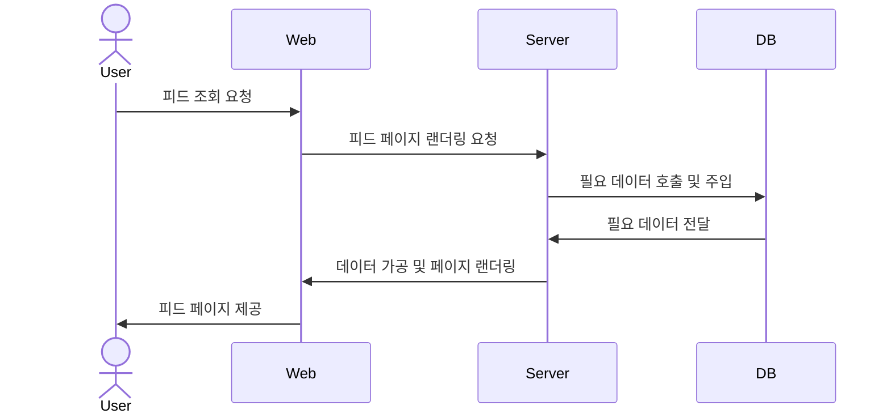
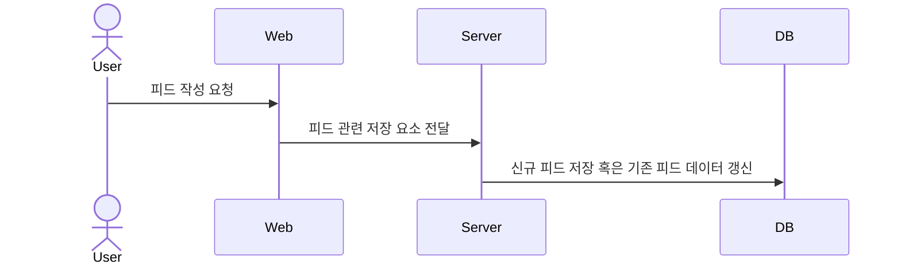
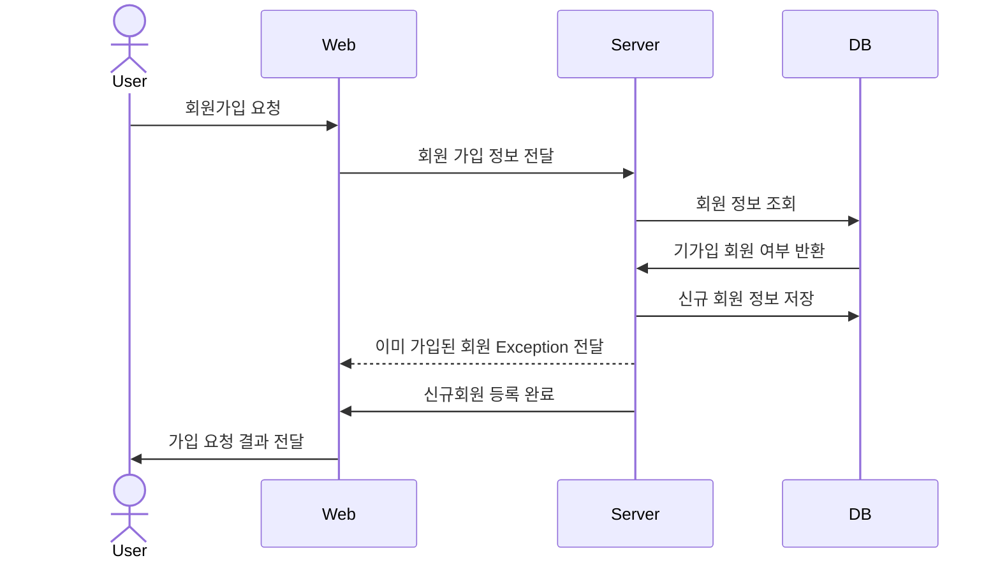
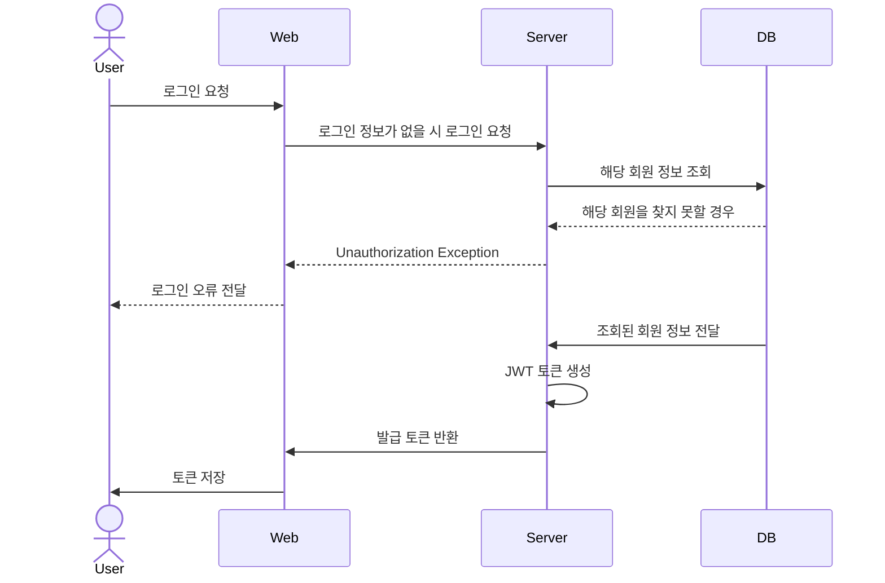
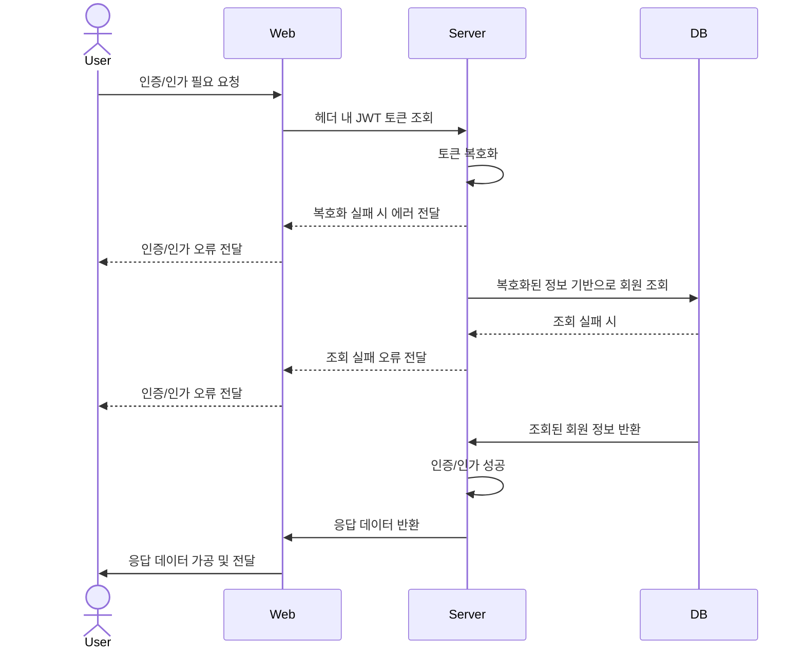
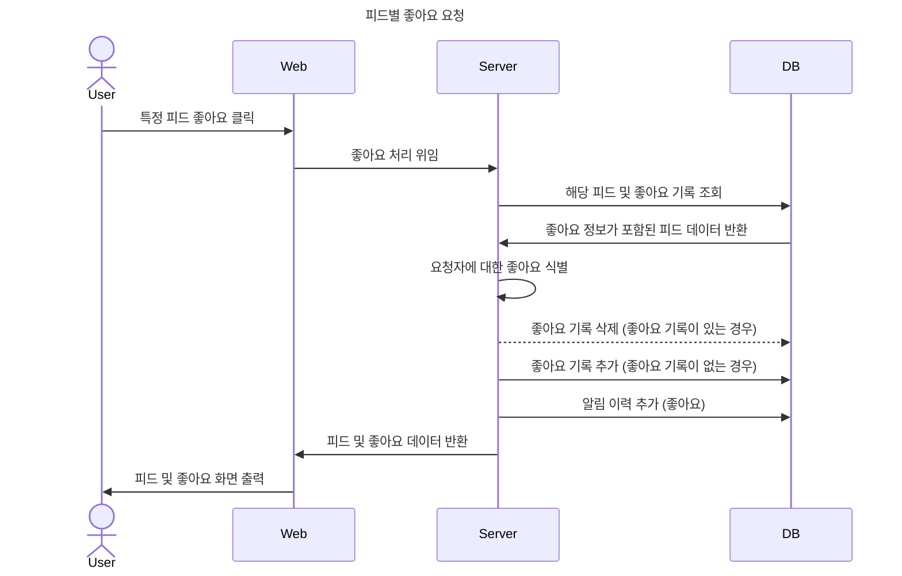
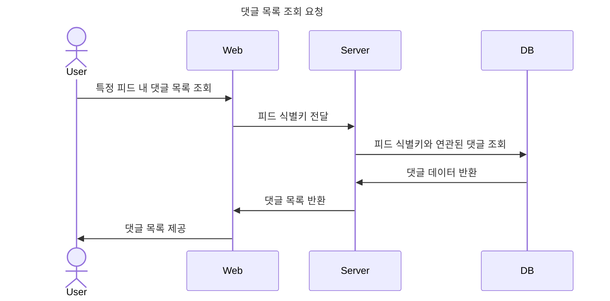
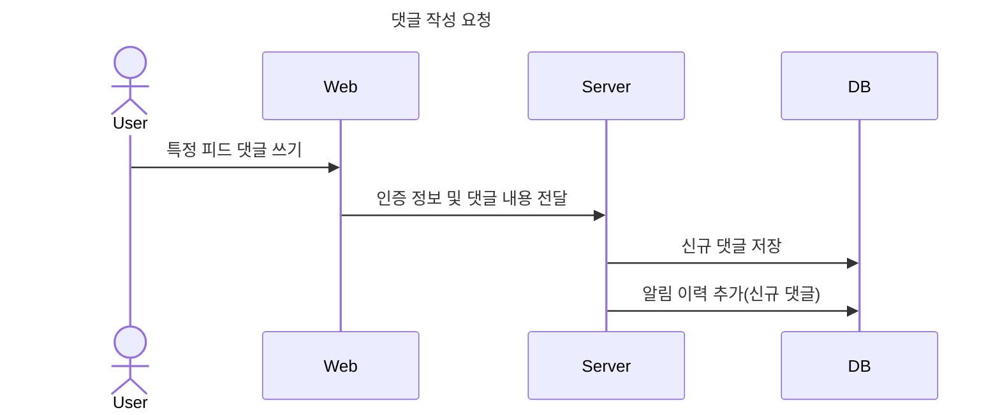
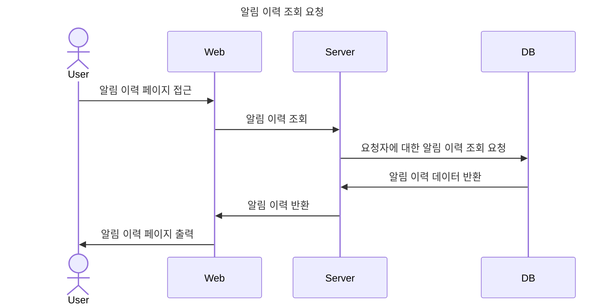
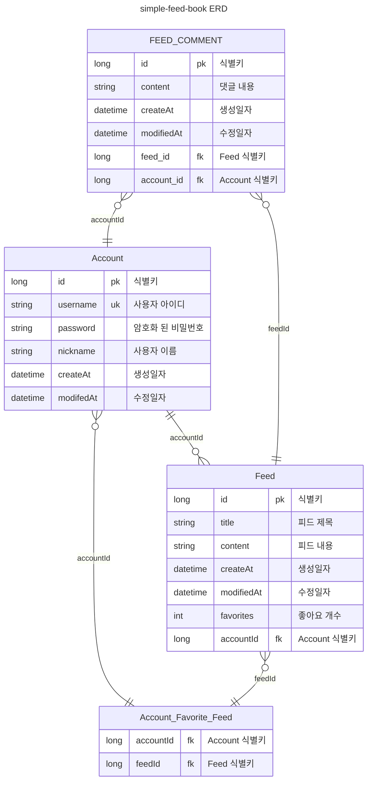

# simple-feed-book
> 사용자들간의 피드 공유 사이트
> 

# 요구사항

- 전체 사용자들에 대한 피드를 볼 수 있다.
    - 피드는 제목, 내용, 작성자명 등으로 이루어져 있다.
- 회원가입 및 로그인을 통해 해당 서비스를 이용할 수 있다.
- 사용자면 누구나 피드를 작성할 수 있다.
- 자기 자신이 작성한 피드들을 모아볼 수 있다.
- 자기 자신이 작성한 피드의 경우 수정 및 삭제가 가능하다.

## 추가 요구사항

- 좋아요 기능 추가
  - 좋아요를 누를 수 있다.
  - 피드마다 좋아요 개수가 보인다.
- 댓글 기능 추가
  - 피드마다 댓글을 작성할 수 있다.
  - 댓글 작성자와 댓글 내용을 제공한다.
  - 댓글목록은 pagination으로 처리한다.
- 알림 기능 추가
  - 별도 알림 탭에서 신규 알림 목록을 볼 수 있다.
    - 작성 피드의 신규 댓글 알림
    - 좋아요 알림

# 수행 흐름

## 피드 조회 요청

## 피드 작성 요청

## 회원가입 요청

## 로그인 요청

## 인증/인가 처리

## 좋아요 요청 처리

## 댓글 목록 조회 요청

## 댓글 작성 요청

## 알림 이력 조회

# 도메인 구조

## ERD

# server 모듈 의존성

## 실행 환경

- java 17
- spring-boot 3.1.6
    - spring-data-jpa
    - spring-web
    - spring-security
    - spring-configuration-processor
    - spring-devtool
    - spring-docker-compose
- postgres 16
- lombok

## 테스트 환경

- spring-boot 3.1.6
    - spring-boot-test
    - spring-security-test
    - testcontainers